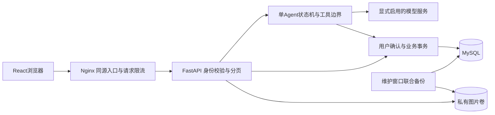

# SoloMeal 架构决策（P0 / P1）

初建于 2026-09-05，早期ADR保留当时语境；2026-09-17追加部署边界。目标范围见 ../SOLOMEAL_PLAN.md，验收进度见 ../SOLOMEAL_STATUS.md。

## 当前部署关系（2026-09-17）

api/db不发布宿主机端口；模型开关默认关闭。Nginx按实际连接IP限制普通、认证和模型执行请求；数据库仍是身份、运行状态与业务修改的事实来源。列表分页只限制REST查询，内部规划不截断库存。具体参数、限流适用边界和嵌套历史限制见[部署指南](../deploy/README.md)。新边界代码已在独立环境验证，源18080尚未更新。

## ADR-001：同仓库独立后端

新增 backend/app，原插件 src 和入口继续标准库/JSON。应用不调用全局 configure 切换用户；每请求独立 SQLAlchemy Session。未来复用算法时提取纯函数并注明出处，不引入存储单例。

## ADR-002：迁移语义

原库存是近似“菜份”，不能转换为克。未来导入只生成待确认草稿；保留别名、名称、必需/可选标记和原始数值/单位说明。历史记录没有批次消耗，不能生成虚假精确消耗或可恢复库存。旧数据目录禁止当演示 seed；新演示数据放 fixtures/seed。

## ADR-003：认证基础

首版使用高熵随机 bearer token、数据库存摘要、到期校验和注销删除。密码使用 Argon2。选择可撤销会话，避免当前阶段引入 JWT 撤销机制。user_id 只取服务端身份；偏好接口固定 /me，不接受客户端目标用户。公开上线前补登录限流等加固。

## ADR-004：数据库与确认事务

正式存储 MySQL，迁移由 Alembic 显式执行，不自动 create_all。SQLite 只验证 API/迁移可执行性。真实 MySQL 与锁测试为阶段验收必要条件。模型调用期间不持锁；写操作短事务，幂等标识绑定用户/请求摘要，重试查已有结果。

## ADR-005：业务数据按阶段演进

0001 仅 users/preferences/auth_sessions。库存与菜谱模型在 P1-02/P2 前补全设计及迁移，不预先建一堆未使用的表。P1 整体仍未完成。AuthSession 时间使用 Unix 秒；完整时间字段与长期范围需在后续 schema review 检查。

## ADR-006：环境和 CI

Python3.13 Windows 虚拟环境已隔离安装、版本锁定；不改全局 Python 依赖。旧 CI 的 mypy -p 与 coverage --source=src,. 可能扫描 backend；P1-04 必须为旧/新代码建立独立检查和聚合 gate，不降低旧 91% 门槛。当前已隔离扫描范围并配置 backend/frontend/browser-e2e job，均汇入 ci-complete；远程 CI 尚未运行。

## 正式版范围

US01～US08 按 PLAN 冻结；多日规划/主动提醒/自动下单不在当前交付。具体模型留至 P5 核验。优先完成 P1、P2、P3，再接 Agent。

## ADR-007：沿用显式单 Agent 状态机（2026-09-08）

审阅发现原计划指定 LangGraph，但 app/services/agent.py 实际以 ready/running/awaiting_confirmation 等状态、租约、数据库事件与显式确认实现循环，requirements.lock 未引入 LangGraph。当前保留这套已覆盖恢复与幂等的实现，并同步计划，避免为匹配框架名称重写事务边界。

这是实现选择的对齐，不代表真实模型效果已验证。LangGraph 只有在流程复杂度需要时再评估；届时必须明确检查点与现有数据库状态的唯一事实来源，保留幂等/取消/租约/SSE 回归。业务写入始终由同一服务层执行。
